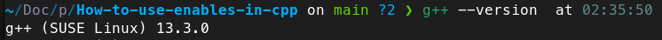
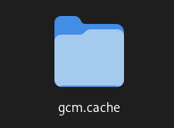

# Modules in C++

I'm using G++ 13 on OpenSuse, this's my version. Make sure you've the same version or above.



First of all, compile iostream to a module.
``` 
g++ -fmodules-ts -x c++-system-header iostream  
```

If you see this folder, everything worked!




Now, you can use the code here! Just run:

```
g++ -fmodules-ts sum.cpp main.cpp -o sum && ./sum
```

If you see the number `3` in your terminal, everything worked!
